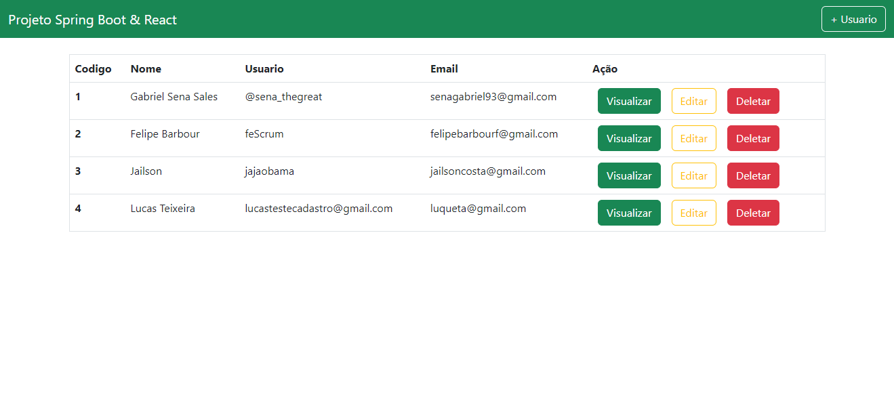
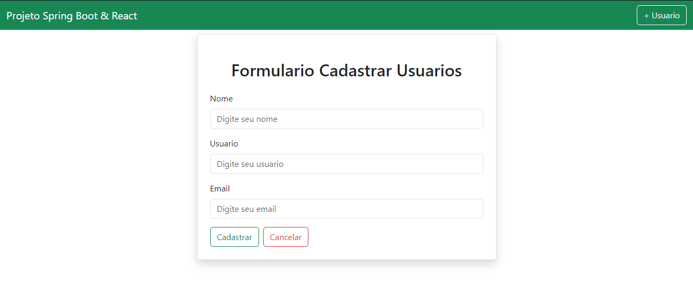
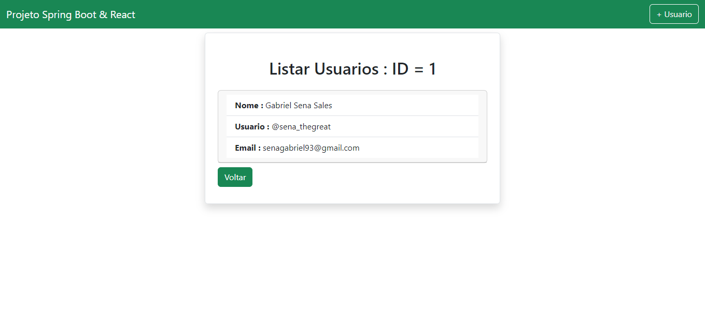
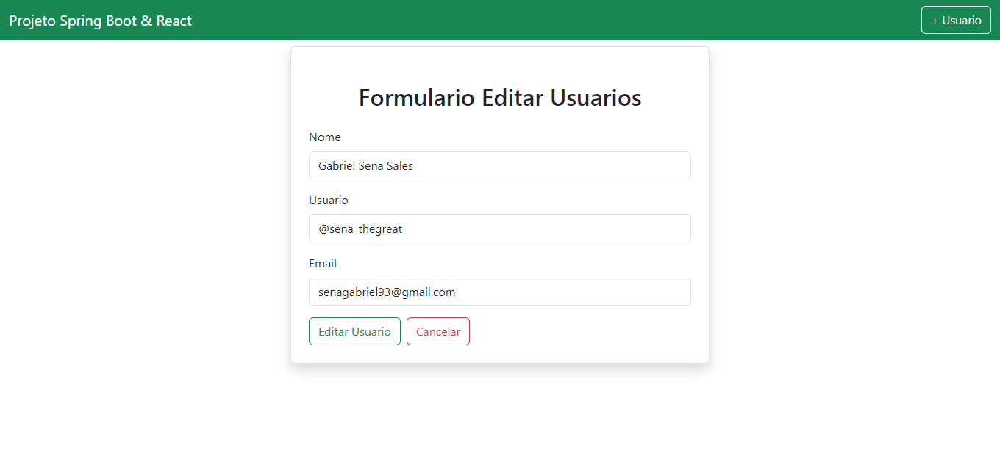

<h1 align="center"> CRUD SPRING BOOT & REACT </h1>

  <a href="#-tecnologias">Tecnologias</a>&nbsp;&nbsp;&nbsp;|&nbsp;&nbsp;&nbsp;
  <a href="#-projeto">Projeto</a>&nbsp;&nbsp;&nbsp;|&nbsp;&nbsp;&nbsp;
  <a href="#memo-licença">Licença</a>

  

 

  

  

  

  

## 🚀 Tecnologias

Esse projeto foi desenvolvido com as seguintes tecnologias:

- Spring Boot
- React Js
- Bootstrap
- Postman
- MySQL

## 💻 Projeto

A definição de CRUD é:
Create - CRIAR
Read - VISUALIZAR
Update - ATUALIZAR
Delete - APAGAR

Portanto, esse projeto atente todos esses quesitos e utiliza a biblioteca Spring Boot da linguagem Java para o Back-end, React JS para o Front-end e MySQL como SGDB! Além disso, foi utilizado Bootstrap para estilização do Layout e o Postman para testes de: Post,Get,Put & Del.

## 🪪 Licença

Esse projeto está sob a licença MIT.

---

Feito com ♥ por sena_thegreat
